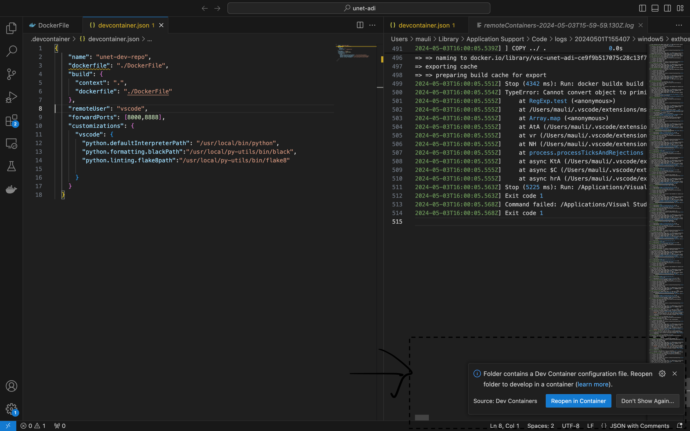
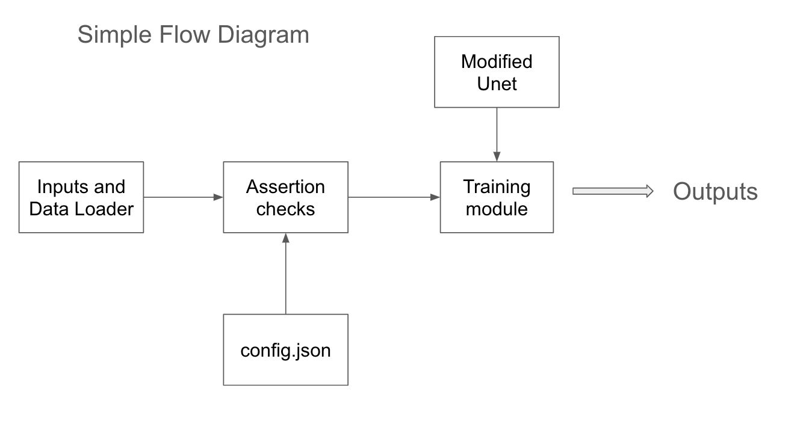

# Table of contents

1. [Introduction](#introduction)
2. [Quick Run](#quick-run)
    - [Prerequiste](#prerequiste)
    - [Using Docker](#run-using-docker)
    - [Using Virtualenv](#run-using-virtualenv)
3. [Tutorial](#tutorial)
4. [Configuration](#configuration)
5. [Take Home Test Requirements](#take-home-test-requirements)
    - [Limitations](#limitations)
    - [Framework Choice](#framework-choices)
6. [Model Information](#model-information)
7. [Code Design](#code-design)
    - [Source code directory structure](#source-code-directory-structure)
    -  [Parameters and Unet Hyperparameters](#parameters-and-unet-hyperparameters)
    -  [Architecture Block Diagram](#architecture-block-diagram)
    - [Docker Info](#docker-info)
    - [Making code changes](#making-code-changes) 
8. [References](#references)


# Introduction 

This modified U-net consist of training pipeline code, which could be used to train a modified U-net model with 2 variations:
- Vanilla Convolution Network
- TsConv Layer

# Quick Run 


## Prerequiste: 
- Docker [**Optional but highly recommended**]
- Python 3.11 [**If no docker is used**]
- VsCode [**Optional but highly recommended**]
It is recommended to use Docker, 
If running docker on Mac-Apple Silicon, ensure to have rosetta enabled

## Run using Docker
From the root repositoru, use the following:
```
docker build -t <tailored-image-name> .
```

```
docker run --rm   <tailored-image-name>  --use_TSConv
```

## Run using Virtualenv
Run the vanilla python with Tsconv
If running without docker, please use the virtual enviroment

To use virtual environment

```
virtualenv <env-name>
source <env-name>/bin/activate
pip3 install -r requirements-virtualenv.txt
```

Run the following command once virtual environment is activated

Run with TsConv Layer

```
python3 train.py --use_TSConv

```

Run the model with Traditional Unet 

```
python3 train.py 
```


###  Unit test
To run unit test in  Virtual Environment.
```
 py.test
 ```

The tests are made according to [Arrange-Act-Assert](https://automationpanda.com/2020/07/07/arrange-act-assert-a-pattern-for-writing-good-tests/) architecture

The tests are currently developwed using pytest[https://docs.pytest.org/en/8.2.x/] 

To run code coverage
```
cd src
pytest --cov ./  --cov-config=.coveragerc
```
The current code coverage is 84%


# Tutorial

For Editing its best to use Dev Containers with VsCode (versions > 1.82) 
To set up the  Vscode IDE with Dev Containers, simply open the folder in Vscode
The Dev Containers options pops up here



You can also select option: "Dev Containers: Reopen and Attach in Container" by simply selecting from Command Palette (Command+Shift+P) or (Ctrl+Shift+P)

Once Dev containers are opened, you can run the python functions as per requirements

Using [Quick run](#quick-run) you can run without your data. The code uses random noise as images.
To use your own data. You can run the following

```
cd src
python3 train.py --train_data_path data-dir/train-example.npy --segmented_data_path data-dir/segmented-output.npy
```


To use TSConv
The TSConv uses tailored Conv2D architecture which reduces the number of layers by 1/3rd 
Without TSConv flag,m traditional Conv2D is used.
```
python3 train.py --use_TSConv
```

To save model in another directory. By default models are saved in output-logs

```
python3 train.py --model-output-dir <Tailored-directory>
```

Get your own configs!

You can use your own config.json with tailored parameters. Simply pass a new config.json file path

```
python3 train.py  --config_json <tailored_config.json_path>
```
There are few parameters listed above, You can refer to [Configuration](#configuration) for all parameters


# Configuration
The parameters are split between argparse and config.json
The Hyperparameters are defined in config.json. This is done in order so that tailored config.json could be defined with specfic Hyperparametets

Parameter args: 

- **train_data_path**: Train Image data in numpy format. The example attached in data-dir folder is random noise for illustrations purposes only
- **segmented_data_path**: Segmented Image in numpy output format. The example attached in data-dir folder is random noise for illustrations purposes only
- **config_json**: Config.json path. All Hyperparameter can be defined here. You can pass your own tailored config.json
- **model-output-dir**: Model output directory where model could be saved. Currently no other tracking or experimentation output is saved other than the model artifact.
- **batch_size**: Batch size


Config.json args:

1. **timesteps** [int]: Variable audio [noise] length data is created with fixed 256 bin (pre-requistes). This option is not needed if using your own data.
2. **train_gen** [int]: Number of train data samples to be generated
3. **optimizer** [str]: Available optimizer variables: 
    - SGD
    - Adam
    - AdamW
    - Adadelta
    - Adagrad
    - Adamax
    - Adafactor
    - Nadam
    - Ftrl
    - Lion
    - Loss Scale Optimizer
    For more information on usage visit: https://keras.io/api/optimizers/ 

4. **loss**: Available regression loss errors can be found at:
https://keras.io/api/losses/regression_losses/

5. **learning_rate** [int] Learning rate for the Convolution/TSConv network model
6. **epochs** [int]: Epochs for training 


# Take home Test requirements:
The output-logs are attached in the output folder with Traditional convolution output and TSConv layer output


## Limitations:
- Currently the data array needs to be fixed size. A data loader is not implemented, thus variable size spectrogram images within a same dataset is not handled. The model only focuses on the training code. Although timesteps can be varying and random data can be created if no data is passed
- Security Checks: No SAST checks has been done for this module.
- Orchestration: No workflows or pipelines exist and deemed to be out of scope as well as deployment (builds) code.
- Hyperparameters: Few parameters are hard coded (eg: padding,stride) as per given instructions. This is to limit scope of parameters exposure. 
- Data Rescaling: Current Data Rescaling was left out from this project
- Custom Loss and optimizer functions: custom loss functions cannot be passed directly into code and code modifications would be required
- Other: No Model orchestration done, No checkpointing and no deployment guidelines available as of now.


## Framework choices:
- Tensorflow vs Pytorch: Had brief experience with CNN in tensorflow due to which choice was made.
- Docker containers: For easier reproducibility on any OS and to keep OS python environments cleaner. 


# Model Information

The TSConv layer is designed for processing spectrogram images data within a convolutional neural network. 
It separates the input features into static and dynamic components. The choice argument allows for 
potential variations in how the dynamic part is handled (specific details depend on the chosen variant).
This layer typically performs a convolution after some manipulation of the dynamic features, aiming to 
extract relevant patterns from the data
To achieve TSConv
The layers were split into two channels, static and dynamic
The dynamic channels were further split into two channels one with a forward and one with backward shift

The encoder-decoder blocks are characterized to decide whether to go with TSConv or general Convolution Network


# Code Design

## Source code directory structure:

- models: Contains the encoder-decoder as well as TSConv layer code
- train.py: Main executable file for training
- parameter_validations.py: Assert values mentioned in config.json and argparse whether they are defined as per required standards. This could help in limiting the values as per requirements as per required security standards
- requirements.txt: Requirements for virtualenv

## Parameters and Unet Hyperparameters
The argparse are generally code parameters which are created to have developer friendly deployment, While hyperparameters are passed as a config.json which could be parsed for user-friendly environments

## Architecture Block Diagram


## Docker Info
Used Tensorflow 2.15 with Jupyter and general exposed ports so it could be used as dual purpose: development+deployment 
Vscode gives good amount of extensions thus ensuring code consistency, thus an option of .devcontainers was provided.
Dev Container takes advantage of extensions that could used to write better code. For display purposes, we have only used Auto Black Formatter only.

Currently only tensorflow-cpu is use. Please Change the Dockerfile Image to tensorflow-gpu in order to use Gpu.

## Making code changes 
You can use Vscode editor by opening in dev containers. Please see [tutorial](#tutorial) section on how to open Vecode in dev containers

To run Linting
```
flake8
```


# References 
Few references used while creating this project
- [Understanding CNN](https://www.youtube.com/watch?v=SH8D4WJBhms)
- [Understanding Unet](https://www.youtube.com/watch?v=GAYJ81M58y8)
- [Pytest Coverage](https://coverage.readthedocs.io/en/7.5.0/)
- [PEP8](https://peps.python.org/pep-0008/)
- [VSCode Dev Containers](https://code.visualstudio.com/docs/devcontainers/create-dev-container)